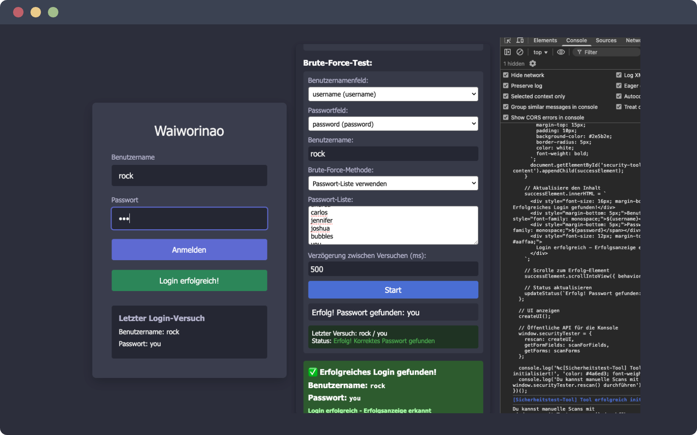

# Waiworinao - Security Testing Tool

## Project Overview

Waiworinao is a client-side security testing tool designed for web applications. It creates a
floating interface in the browser that helps developers identify and test form vulnerabilities for
ethical security testing purposes.



## Features

-   **Form Field Scanner**: Automatically detects and analyzes all input fields on a webpage
-   **Form Analysis**: Identifies forms and their properties including method, action, and submit
    buttons
-   **Credential Testing**: Provides interface for testing username/password combinations
-   **Brute Force Testing**: Includes options for testing with password lists or character set
    combinations
-   **Visual Feedback**: Provides real-time status updates on testing progress
-   **Interactive UI**: Draggable interface with toggle functionality for better usability

## Technical Details

-   Pure JavaScript implementation that runs in the browser console
-   No external dependencies required
-   Modern UI with dark theme (using `#2C2E3B` color scheme)
-   Event simulation for compatibility with modern JavaScript frameworks

## Usage Warning

This tool is intended **ONLY** for:

-   Security professionals performing authorized penetration testing
-   Developers testing their own applications for vulnerabilities
-   Educational purposes to understand web security concepts

## Demo Application

The project includes a simple login form demo application (`index.html`) that can be used to test the
tool's functionality without compromising external systems.

## Testing the Project

To test the Waiworinao security tool:

1.  Open the `index.html` file in a web browser
2.  Open the browser's developer console (F12 or Right-click > Inspect > Console)
3.  Copy and paste the entire content of the `dntwrry.js` file into the console
4.  Press Enter to execute the code
5.  The security testing interface will appear in the top-right corner of the page
6.  Use the interface to:
    -   Scan for input fields and forms
    -   Test the login functionality (use "rock" as username and "you" as password for successful
        login)
    -   Try the brute force testing features with different options

For security research purposes, you can also use the tool on your own web applications by copying
the script into the console when viewing your application.

## Sample Demo Run

Below is an example of a brute force test run:

1.  **Username field**: Select the field with ID `username`
2.  **Password field**: Select the field with ID `password`
3.  **Username input**: "rock"
4.  **Brute-Force method**: "Use Password List"
5.  **Password list**:
    ```
    butterfly
    purple
    angel
    jordan
    liverpool
    justin
    loveme
    fuckyou
    123123
    football
    secret
    andrea
    carlos
    jennifer
    joshua
    bubbles
    you
    ```
6.  **Test progress**:
    -   Test 1/17: rock / butterfly - Failed
    -   Test 2/17: rock / purple - Failed
    -   Test 3/17: rock / angel - Failed
    -   Test 4/17: rock / jordan - Failed
    -   Test 5/17: rock / liverpool - Failed
    -   Test 6/17: rock / justin - Failed
    -   Test 7/17: rock / loveme - Failed
    -   Test 8/17: rock / fuckyou - Failed
    -   Test 9/17: rock / 123123 - Failed
    -   Test 10/17: rock / football - Failed
    -   Test 11/17: rock / secret - Failed
    -   Test 12/17: rock / andrea - Failed
    -   Test 13/17: rock / carlos - Failed
    -   Test 14/17: rock / jennifer - Failed
    -   Test 15/17: rock / joshua - Failed
    -   Test 16/17: rock / bubbles - Failed
    -   Test 17/17: rock / you - Success!
7.  **Result message**: "✅ Successful login found! Username: rock, Password: you"

This demo shows how the tool successfully identifies the correct credentials by testing a list of common passwords against the specified username.

## Implementation

The tool works by:

1.  Creating a floating panel in the DOM
2.  Scanning the page for form elements and input fields
3.  Allowing user-configurable testing parameters
4.  Simulating user interactions with the detected forms
5.  Monitoring for success/failure indicators

## Project Structure

-   `dntwrry.js` - Main tool implementation
-   `index.html` - Demo application for testing
-   Various configuration files (`.gitignore`, `package.json`, etc.)

---

*Side note: The project name "Waiworinao" comes from Ricardo Villalobos' track of the same
name ([https://www.youtube.com/watch?v=8FvoJ-HahyQ](https://www.youtube.com/watch?v=8FvoJ-HahyQ)). The name is a play on words, essentially
meaning "Why worry now?"*